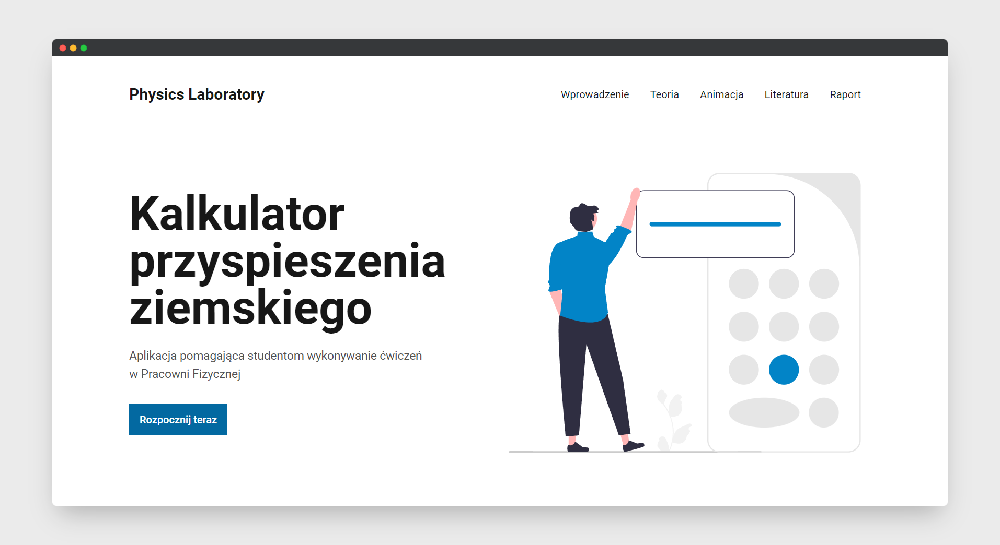

# Physics Laboratory

## Project prupose

**Earth Acceleration App** is an application designed to assist students in conducting experiments in the Physics Laboratory. It facilitates the determination of Earth's acceleration (using a mathematical pendulum) and allows for the export of reports in PDF format. The project itself was created as part of an engineering project.



## How to run?

**1. Clone this repository:**

```
git clone git@github.com:KoTubA/earth-acceleration-app.git
```

or:

```
git clone https://github.com/KoTubA/earth-acceleration-app.git
```

**2. Install npm packages:**

```sql
npm install
```

**3. Start developing.**

Navigate into site’s directory and start it up.

```shell
cd earth-acceleration-app/
npm run dev
```

**4. Open the code and start customizing!**

The site is now running at http://localhost:5173/

Edit `src` folder to see your site update in real-time!

**5. Learn more**

Currently, two official plugins are available:

- [@vitejs/plugin-react](https://github.com/vitejs/vite-plugin-react/blob/main/packages/plugin-react/README.md) uses [Babel](https://babeljs.io/) for Fast Refresh
- [@vitejs/plugin-react-swc](https://github.com/vitejs/vite-plugin-react-swc) uses [SWC](https://swc.rs/) for Fast Refresh

## Live demo

Link to demo: https://earth-acceleration-app.netlify.app/
